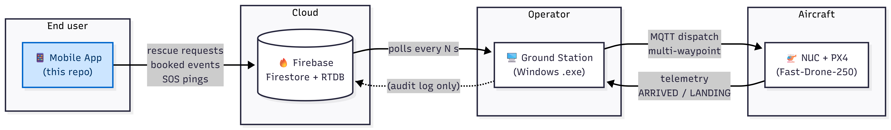
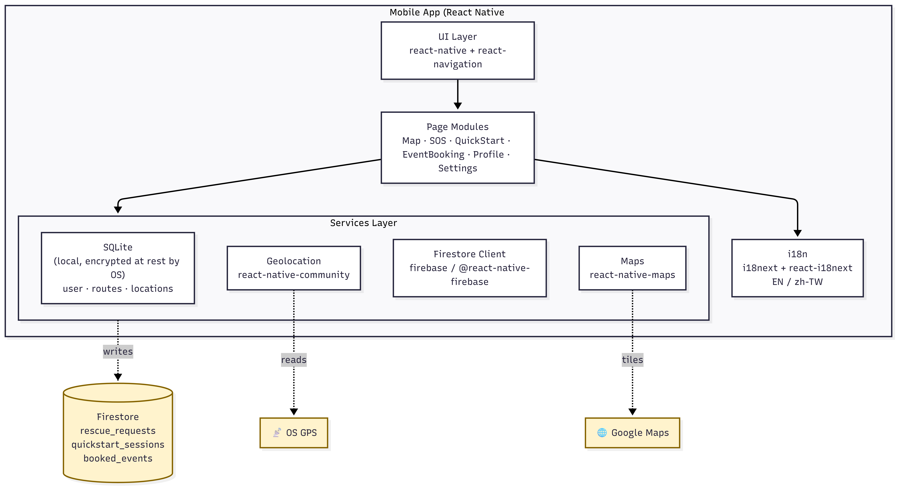
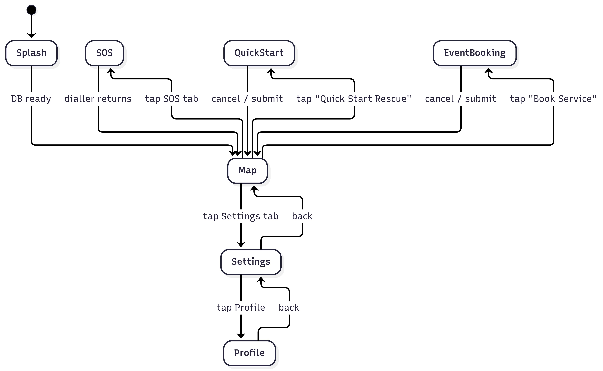
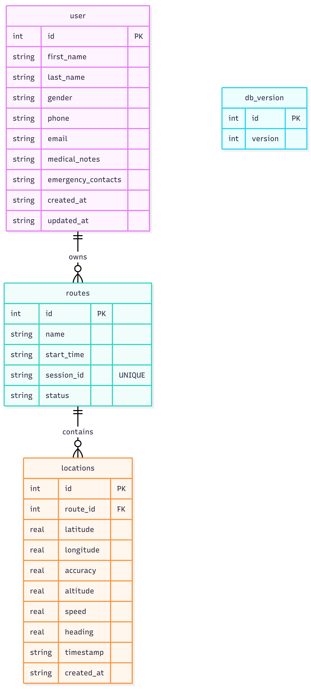

<div align="center">

# alin1-mobile

**Project Alin-1 — Mobile App for Air-Ground Collaborative Rescue**

[](https://reactnative.dev)
[](https://www.typescriptlang.org/)
[](https://firebase.google.com/)
[](./LICENSE)
[]()

The user-facing client of the **Project Alin-1** rescue-drone system. A bilingual (English / 繁體中文) iOS + Android app that lets civilians request a rescue drone, mark waypoints on a map, book scheduled flights, and call 999 in a single tap.

<sub>HKMU COMP S456 Final Year Project — companion to [`alin1-groundstation`](../alin1-groundstation) and [`alin1-drone`](../alin1-drone).</sub>

</div>

> 

---

## Table of Contents

- [alin1-mobile](#alin1-mobile)
  - [Table of Contents](#table-of-contents)
  - [1. What It Does](#1-what-it-does)
  - [2. Where It Sits in the Bigger System](#2-where-it-sits-in-the-bigger-system)
  - [3. Architecture](#3-architecture)
  - [4. Screen Map](#4-screen-map)
  - [5. Tech Stack](#5-tech-stack)
  - [6. Project Layout](#6-project-layout)
  - [7. Getting Started](#7-getting-started)
  - [8. Configuration](#8-configuration)
    - [Firebase](#firebase)
    - [Map permissions](#map-permissions)
    - [Default map centre](#default-map-centre)
  - [9. Build \& Release](#9-build--release)
    - [Android (release APK)](#android-release-apk)
    - [iOS (Xcode archive)](#ios-xcode-archive)
  - [10. Testing](#10-testing)
  - [11. Internationalisation](#11-internationalisation)
  - [12. Local Database](#12-local-database)
  - [13. Known Caveats](#13-known-caveats)
  - [14. Credits](#14-credits)
  - [15. Licence](#15-licence)

---

## 1. What It Does

Alin-1 Mobile is the **request side** of an emergency drone rescue system. A user in distress (lost on a hike, stranded, requiring delivery of a small medical payload) opens the app and either:

| Flow | When to use | Result |
| --- | --- | --- |
| **Quick Start** | Immediate, ad-hoc rescue | Drops a single waypoint → ground station picks it up from Firestore → drone is dispatched |
| **Event Booking** | Pre-planned multi-waypoint mission (e.g. a hiking-club aerial sweep) | Saves an ordered list of GPS points + time slot → ground station schedules the mission |
| **SOS** | Imminent danger | One-tap **999 dialler** + Firestore rescue request with current GPS |
| **Profile** | Onboarding | Stores name, phone, medical notes, emergency contacts in **on-device SQLite** (never sent to Firebase) |

The app **does not control the drone directly**. All flight commands are issued by the Windows ground station after a human operator triages the request.

## 2. Where It Sits in the Bigger System

> 

The **mobile app talks only to Firebase** — never directly to MQTT or to the drone. This boundary is part of the project's access-control mandate: by design, an end user cannot command an aircraft without an operator in the loop.

## 3. Architecture

> 

**Design choices worth knowing:**

- **Local-first profile data.** Personal details (name, phone, medical notes, emergency contacts) live in SQLite on the device. They are *not* synced to Firebase. Only the bare minimum — GPS, waypoints, timestamp, and the user's phone number for callback — is transmitted on a rescue request.
- **No background tracking.** Geolocation is requested on demand, not continuously. The `routes` and `locations` tables exist for opt-in route recording, not silent tracking.
- **Modal-driven map page.** The home Map page is intentionally read-only (zoom / scroll disabled). All actions go through a bottom-sheet modal so the most prominent UI element is always "request rescue".
- **Versioned migrations.** Two SQLite migrations run on first launch; schema version is tracked in a `db_version` table so old installs upgrade cleanly.

## 4. Screen Map

> 

| # | Page | File | Purpose |
| --- | --- | --- | --- |
| 1 | Map | `pages/MapPage.tsx` | Home page — fixed Hong Kong view + action sheet |
| 2 | SOS | `pages/SosPage.tsx` | One-tap 999 + Firestore rescue request with GPS |
| 3 | Settings | `pages/SettingPage.tsx` | Language toggle, About, Terms, Privacy |
| 4 | Quick Start | `pages/QuickStartPage.tsx` | Immediate single-waypoint rescue |
| 5 | Event Booking | `pages/EventBookingPage.tsx` | Multi-waypoint scheduled flight |
| 6 | Profile | `pages/ProfilePage.tsx` | User details (local SQLite) |

## 5. Tech Stack

| Layer | Choice | Why |
| --- | --- | --- |
| Runtime | React Native 0.80.2 (New Architecture) | Native iOS + Android from one TS codebase |
| Language | TypeScript 5.0 | Catch GPS-payload typos at compile time |
| Navigation | `@react-navigation/stack` 7 | Stack-based, low-friction |
| Maps | `react-native-maps` 1.26 | Wraps Google Maps SDK natively |
| Geolocation | `@react-native-community/geolocation` | OS-level permission handling |
| Local DB | `react-native-sqlite-storage` 6 | Local-first profile + opt-in routes |
| Cloud DB | `firebase` 12 + `@react-native-firebase` 18 | Firestore — single shared backend with the ground station |
| State | React `useState` / `useEffect` | The app is small enough that Redux/Zustand would be over-engineering |
| i18n | `i18next` 25 + `react-i18next` 15 | EN / zh-TW |
| UI primitives | `react-native-vector-icons`, `react-native-modal`, `react-native-date-picker` | Off-the-shelf, well-maintained |

## 6. Project Layout

```
alin1-mobile/
├── App.tsx                    # Top-level <SafeAreaView> + page switcher
├── index.js                   # AppRegistry entry
├── app.json                   # RN bundler metadata
├── package.json
├── tsconfig.json
├── babel.config.js
├── metro.config.js
├── jest.config.js
├── components/
│   ├── Header.tsx             # Top bar
│   ├── Footer.tsx             # Bottom tab bar (Map / SOS / Settings)
│   ├── Content.tsx            # Page router
│   └── index.tsx              # Re-exports
├── pages/
│   ├── MapPage.tsx
│   ├── SosPage.tsx
│   ├── QuickStartPage.tsx
│   ├── EventBookingPage.tsx
│   ├── ProfilePage.tsx
│   └── SettingPage.tsx
├── services/
│   └── db/
│       ├── initDb.ts          # SQLite open + versioned migrations
│       ├── database.ts        # Connection wrapper
│       ├── locationService.ts # Geolocation helpers
│       ├── LocationRepository.ts
│       └── firebaseConfig.ts  # Firebase init (config inlined — see §8)
├── translations/
│   ├── i18n.ts                # i18next bootstrap
│   ├── en/translations.json
│   └── zh/translations.json
├── android/                   # Native Android project (Gradle)
├── ios/                       # Native iOS project (CocoaPods)
└── __tests__/
    └── App.test.tsx
```

## 7. Getting Started

> **Prerequisites.** Follow the official [React Native environment setup](https://reactnative.dev/docs/set-up-your-environment) for both iOS and Android **before** the steps below. You will need: Node ≥ 18, Watchman, Xcode 15+, CocoaPods, Android Studio with SDK 34, JDK 17, Ruby (bundler).

```bash
# 1. Clone
git clone https://github.com/Mikeahhh/alin1-mobile.git
cd alin1-mobile

# 2. Install JS dependencies
npm install

# 3. iOS only — install native pods
bundle install                # first time only, installs CocoaPods
bundle exec pod install --project-directory=ios

# 4. Start Metro bundler in one terminal
npm start

# 5. In another terminal, run on a device / simulator
npm run ios          # iOS
npm run android      # Android
```

The first Android build pulls Gradle dependencies and may take 5–10 minutes; subsequent builds are incremental.

## 8. Configuration

### Firebase

The Firebase Web SDK config is inlined in [`services/db/firebaseConfig.ts`](services/db/firebaseConfig.ts) and points at the project's `mydrone-7dff8` Firestore instance. The **Android app** additionally consumes [`android/app/google-services.json`](android/app/google-services.json), and the **iOS app** consumes the iOS counterpart through CocoaPods.

> If you fork this project for your own use, swap both files for your own Firebase project and rotate any keys you may have inherited.

### Map permissions

| Platform | File | Key |
| --- | --- | --- |
| Android | `android/app/src/main/AndroidManifest.xml` | `ACCESS_FINE_LOCATION`, `ACCESS_COARSE_LOCATION`, `INTERNET` |
| iOS | `ios/FypProject/Info.plist` | `NSLocationWhenInUseUsageDescription` |

### Default map centre

Hong Kong (22.3193 °N, 114.1694 °E) — change in `pages/MapPage.tsx` `initialRegion`.

## 9. Build & Release

### Android (release APK)

```bash
cd android
./gradlew assembleRelease
# Artefact: android/app/build/outputs/apk/release/app-release.apk
```

The release keystore is checked in at `android/app/release-key.jks` for project-internal demo purposes. **For any external distribution you must replace this with your own keystore.**

### iOS (Xcode archive)

Open `ios/FypProject.xcworkspace` in Xcode → Product → Archive. The scheme `FypProject` is configured with the project's bundle ID.

## 10. Testing

```bash
npm test               # Jest + react-test-renderer
npm run lint           # ESLint
```

A smoke test for `App.tsx` rendering lives in `__tests__/App.test.tsx`.

## 11. Internationalisation

`i18next` is bootstrapped in `translations/i18n.ts` and reads from `translations/en/translations.json` and `translations/zh/translations.json`. To add a new locale, drop a `translations/<locale>/translations.json` file and register it in `i18n.ts`. All UI strings are referenced by `t('namespace.key')` — never hard-coded — so a new locale needs only one JSON file.

## 12. Local Database

**File.** `location_tracker.db`, opened by `react-native-sqlite-storage` in the OS default location (app sandbox). Wiped on app uninstall.

**Schema (v3).**

> 

Migrations live in `services/db/initDb.ts` and run automatically on app launch — no Flyway/Knex dependency.

## 13. Known Caveats

- **No biometric lock.** The app does not require Face ID / fingerprint to send a rescue request. This is deliberate (an injured user must be able to fire SOS without authentication), but it does mean a stolen phone could fire spurious requests. Operator-side triage is the mitigation.
- **Single hard-coded Firebase project.** Swapping projects requires rebuilding the binary.
- **Hong Kong-centric defaults.** Map centre, locale fallback, and the 999 dialler are all HK-specific. Reconfigurable but not abstracted.
- **No offline queue.** SOS requests sent while offline are dropped, not retried. A future improvement would be to buffer them in SQLite and flush on reconnect.

## 14. Credits

- **Author** — Wang Mingyang ([Mikeahhh](https://github.com/Mikeahhh))
- **Supervisor** — Dr. Liu Yalin (Alin), HKMU School of Science & Technology
- **Course** — COMP S456 Final Year Project, BSc (Hons) in Computing & Networking, HKMU

## 15. Licence

[MIT](./LICENSE) — see `LICENSE` for the full text. Third-party dependencies retain their own licences (see `package.json`).

---

<div align="center">
<sub>Part of the <b>Project Alin-1</b> rescue-drone trilogy · <a href="../alin1-groundstation">Ground Station</a> · <a href="../alin1-drone">Drone</a></sub>
</div>
